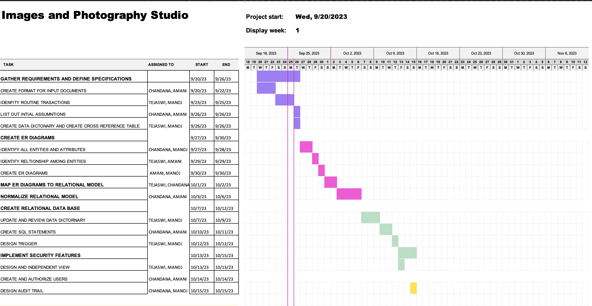

# Customer-Order-Product-Depot Database System



This project models a database system simulating operations for a photography business — including customers, orders, products, and depots. It focuses on relational integrity, efficient querying, and security features.

> **Course:** CS 623 – Database Management Systems  
> **Team:** Team 4  
> **Semester:** Fall 2023

---

## 🧩 Features

- 🗂️ Normalized relational schema with referential integrity
- 🛠️ SQL DDL for schema creation (Chapters 5 & 6)
- 🔁 Triggers for business logic enforcement
- ⚙️ Indexes for performance
- 📊 Reporting and transaction queries
- 🔐 Authorization logic for data access control

---

## 🗃️ Folder Structure

customer-order-product-depot-db/
├── schema/        # All DDL, triggers, indexes, sample data
├── queries/       # Transaction queries, reports, authorization logic
├── docs/          # Project reports, intro, charter, Gantt chart
└── images/        # ER diagrams, relational schema, authorization models

<details>
<summary>📁 View folder structure as YAML</summary>

```yaml
customer-order-product-depot-db:
  schema:
    - ddl.sql
    - sample_data.sql
    - triggers.sql
    - indexes.sql
  queries:
    - reports.sql
    - transactions.sql
    - authorization.sql
  docs:
    - Project_Introduction.docx
    - Team_Charter.docx
    - Final_Report.docx
    - Gantt_Chart.xlsx
    - Chapter5_Writeup.docx
    - Chapter6_Report.docx
    - Chapter8_SecurityReport.docx
    - Chapter10_FinalReview.docx
  images:
    - ER_Diagram_Original.vsdx
    - ER_Diagram_Conditions.vsd
    - Relational_Schema.vsdx
    - Authorization_Visio.vsdx
    - Screenshot_2023-09-25.png
    - group_09-30-23.drawio

